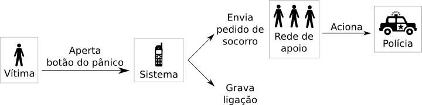

# NoTap.me

A violência doméstica no Brasil é um problema social sério. ADICIONA!!!

## Justificativa

Ao sofrer violência doméstica a vítima tem poucas opções para se defender.
A espera pelo atendimento através do 190 e a necessidade de informar seus dados
nesse momento é impraticável. Além disso, a vítima não pode depender da ajuda
de vizinhos ou familiares que possam ter ouvido o conflito, pois há uma cultura
de não interferir nas relações dos outros e o medo em relação a uma possível
represália do agressor.

A vítima está sozinha.

## Solução do governo

A solução de algumas cidades foi criar um "botão do pânico", um aparelho com o
qual a vítima de violência consegue pedir socorro a polícia em uma emergência.
Na capital do Espírito Santo, Vitória, o sistema foi implantado em 2013 e tem
dado bons resultados. O dispositivo usado lembra um controle remoto de portão
de garagem, é discreto e pequeno e pode ser carregado facilmente em uma bolsa,
sempre a mão.  

A vítima pode apertar o botão do dispositivo, que automaticamente envia um
pedido de socorro à polícia, junto com sua localização, além de iniciar a
gravação do som ambiente para ser usado como como prova.

A juíza Clésia dos Santos Barros da 11ª Vara Criminal de Vitória cita um caso
em [uma matéria para o Fantástico][mulher-agredida-filho] onde o botão do
pânico salvou a vida de uma mulher. Ela sofria de agressões de um filho
dependente de drogas e recebeu um botão do pânico. Algum tempo depois, o filho
a procurou novamente batendo na porta de sua casa, e ela acionou o botão. A
guarda chegou minutos depois, conseguindo evitar o ataque. "Esse botão salvou
minha vida porque, naquele dia, se eu não tivesse o botão ele ia me matar",
conta ela.

Apesar desses casos de sucesso, ela ainda é pouco acessível. João Pessoa, por
exemplo, tem um programa semelhante ao do Espírito Santo chamado SOS Mulher.
Segundo uma [matéria para o jornal Correio da Paraíba de 11 de agosto de
2014][correio-da-paraiba], existem 900 medidas protetivas solicitadas à Justiça
e, ao mesmo tempo, só 15 aparelhos foram disponibilizados. Por isso, entendemos
que há uma demanda para esse programa muito maior que a oferta de aparelhos.

## Outras soluções em desenvolvimento

Entendendo esse problema, outras pessoas estão tentando criar uma forma de
universalizar o acesso a essa tecnologia. O [Instituto Geledés][geledes] está
desenvolvendo o projeto [PLP 2.0][plp-20], [vencedor por voto popular no
Desafio de Impacto Social Google 2014][vencedor-google], um aplicativo para
smartphones que replica a funcionalidade do botão do pânico adicionando
gravação de vídeos e, ao invés de acionar a polícia, ele aciona até 5 pessoas
de confiança da vítima.

Essa é uma iniciativa muito importante, pois torna os atuais botões do pânico
mais acessíveis. Apesar disso, sua abrangência é limitada por exigir o uso de
um smartphone. Segundo [estimativas do eMarketer de dezembro de
2013][uso-smartphone], cerca de 20% dos brasileiros possuem smartphone em 2014.
Esse número diminui quando pensamos em pessoas com smartphone e plano de
dados.

## Nosso projeto

Nosso projeto é inspirado no botão do pânico. Ele provê duas funcionalidades:
pedido de socorro e gravação do som ambiente para criação de provas. O
diferencial é que ele exige somente um celular, não necessariamente smartphone,
sendo acessível para mais pessoas.

### Como funciona?

A vítima se cadastra no nosso sistema previamente, repassando dados como nome e
endereço, e configura a discagem rápida do seu celular para chamar nosso
número.

Feito esse cadastro, quando essa pessoa estiver em uma situação de risco, ela
pode apertar o botão configurado no seu celular. Este irá ligar para nosso
número que, automaticamente, iniciará a gravação do som ambiente e enviará
mensagens de socorro com seus dados para sua rede de apoio. Esta rede de apoio,
por sua vez, acionará as autoridades para prestar socorro.

#### Cadastro

O cadastro se dá através de ONGs ou outras instituições parceiras do projeto.
Elas irão adicionar no sistema o nome, telefone e endereço dessa vítima, e
auxiliá-la na configuração do seu celular, para adicionar o número na lista de
discagem rápida.

#### Rede de apoio

A rede de apoio é formada por pessoas de ONGs parceiras, possivelmente a mesma
onde a pessoa fez seu cadastro. A rede também pode ser formada por amigos ou
parentes da vítima, mas preferimos que haja essa opção dela ser formada por
terceiros sem contato com o agressor para evitar represálias.

Por isso, o nome dos integrantes da rede de apoio não é divulgado.

## Perguntas frequentes

### Como é feito o cadastro?

A vítima de violência doméstica se cadastra através de um parceiro do projeto,
como ONGs e outras organizações. Esse parceiro inscreve seus dados, número de
telefone, explica o funcionamento e auxilia a configurar a discagem rápida no
seu celular. A partir desse momento, essa pessoa já pode utilizar o serviço.

### Por quê não smartphone?

Segundo os dados de XXX, em 2014, apenas 20% de 
Para que o serviço atinja as principais 

## Licença

Este projeto está licenciado sob a GNU Affero General Public License (AGPL)
v3.0 ou superior.

### Ícones

Ícones [Police Car][tnp-29232] por Luis Prado, [Cell Phone][tnp-3204] por Alex
Hartman, e [Person][tnp-12133] por Ferran Brown, retirados do [The Noun
Project][tnp]

[plp-20]: http://www.plp20.org.br/
[geledes]: http://www.geledes.org.br/
[vencedor-google]: https://desafiosocial.withgoogle.com/brazil2014
[ii-hackathon]: http://edemocracia.camara.gov.br/web/hackathon-de-genero-e-cidadania/inicio#.VHcr0lzN-kB
[mulher-agredida-filho]: http://g1.globo.com/fantastico/noticia/2014/09/mulher-agredida-pelo-proprio-filho-so-tem-paz-apos-receber-botao-do-panico.html
[correio-da-paraiba]: http://portalcorreio.uol.com.br/noticias/policia/seguranca/2014/08/11/NWS,244558,8,409,NOTICIAS,2190-BAYEUX-CABEDELO-RECEBEM-APARELHOS-PROGRAMA-SOS-MULHER.aspx
[uso-smartphone]: http://idgnow.com.br/blog/circuito/2014/01/22/base-de-usuarios-de-smartphones-na-america-latina-vai-aumentar-283-em-2014/
[cunhada-assassinada]: http://g1.globo.com/pb/paraiba/noticia/2014/11/professora-e-assassinada-na-pb-e-suspeito-diz-ser-ex-cunhado-da-vitima.html
[tnp]: http://thenounproject.com
[tnp-29232]: http://thenounproject.com/term/police-car/29232/
[tnp-3204]: http://thenounproject.com/term/cell-phone/3204/
[tnp-12133]: http://thenounproject.com/term/person/12133/
